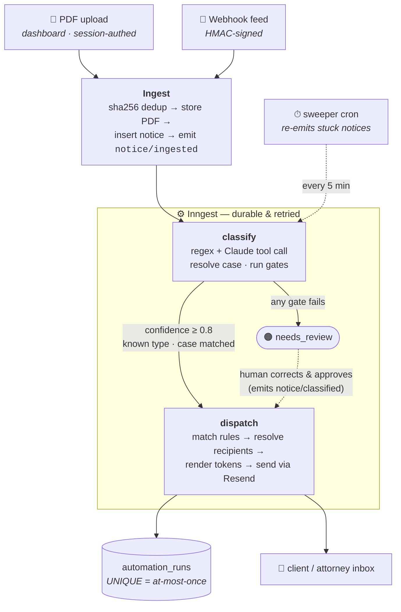
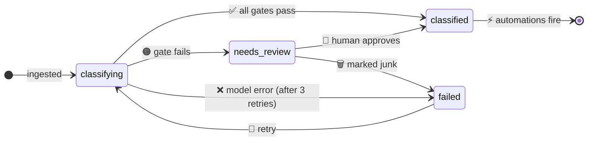

<div align="center">

# ⚖️ Docketly

### Court-notice automation for bankruptcy law firms

A notice arrives from the court → AI reads and classifies it → firm-configured rules email the right people — and **anything the AI isn't sure about waits for a human instead of guessing**.

[](https://docketly-seven.vercel.app)


-2B5C3C)

</div>

---

## The product thesis

Notice handling is a **high-volume, high-stakes, low-judgment** task. The volume and repetition make it ideal for automation. The stakes — a missed hearing can cost a client their case; a wrong email confuses a client and damages trust — make a **confidence-gated, human-in-the-loop** design mandatory rather than optional.

The hard part was never "can a model read a court notice." It's **building the harness around the model so wrong answers are caught before they reach a client.** That harness is what Docketly is.

---

## Table of contents

- [What it does](#-what-it-does)
- [Architecture](#-architecture)
- [The pipeline, step by step](#-the-pipeline-step-by-step)
- [Confidence gating & the human loop](#-confidence-gating--the-human-loop)
- [Data model](#-data-model)
- [The dashboard](#-the-dashboard)
- [Security & privacy](#-security--privacy)
- [Tech stack](#-tech-stack)
- [Running locally](#-running-locally)
- [Eval framework](#-eval-framework)
- [Project structure](#-project-structure)
- [What I'd build next](#-what-id-build-next)

---

## ✨ What it does

| | Feature | Detail |
|---|---|---|
| 📥 | **Two ways in** | An HMAC-signed webhook feed (simulated PACER) and authenticated PDF upload from the dashboard. Replays are deduped at the database layer. |
| 🧠 | **AI classification** | One Claude call (forced tool use, strict schema) extracts notice type, chapter, case number, judge, hearing datetime, confidence, and a one-sentence reasoning. Regex extracts the case number and judge first; the model confirms. |
| 🚦 | **Confidence gate** | `confidence ≥ 0.8` **AND** a recognized type **AND** a case number that resolves against the firm's cases → automations fire. Anything else → the human review queue. **No automated email is ever sent on uncertain data.** |
| ⚡ | **Automations** | Firm-configured rules: *when notice type X arrives (optionally filtered by chapter/judge), email these recipients this template*. Mustache-style `{{tokens}}` fill from the case + classification; unknown tokens render empty, never as literal braces. |
| 👤 | **Human review** | Held notices show **why** they were held. A reviewer corrects any field and approves — the same pipeline fires on human-confirmed data, and the correction is appended to the eval set as a regression test. |
| 📋 | **Full audit trail** | Every automation fire is a row: which rule, which notice, which recipients, sent or failed and why. Notices and runs are never hard-deleted. |
| 📊 | **Measurable quality** | A labeled eval set scores the live classifier on demand — exact-match accuracy, per-type precision/recall, confusion matrix, confidence calibration — and gates on 85%. |

---

## 🏗 Architecture

One Next.js app on Vercel serves both the dashboard and the API. All async work runs in **Inngest** (durable execution, automatic retries with backoff, step memoization, and a trace dashboard) — never in the request path, so the webhook returns in under a second regardless of AI latency.



> **Why Inngest over SQS/Lambda or a hand-rolled worker?** At this scale, managed durability with a built-in trace dashboard beats infrastructure you babysit. The idempotency guarantees live in the **database**, not the queue, so the queue is swappable — the README's roadmap covers moving to SQS + DLQ at scale; both are defensible.

---

## 🔄 The pipeline, step by step

A notice's whole life, from arrival to email or review:



1. **Ingest** (`app/api/ingest`, `app/api/notices/upload`) — verify (HMAC for the webhook, session for upload), compute the `sha256` content hash, store the PDF, insert the notice with `status = classifying`, and emit `notice/ingested`. A replayed payload hits `UNIQUE(firm_id, content_hash)`, inserts nothing, and returns `{ deduped: true }` — emitting no event, so nothing downstream runs.

2. **classify** (`inngest/classify.ts`) — `step.run` the production classification path (`lib/pipeline.ts`): regex pulls the case number + judge (`26-10342-MEW` → `26-10342` + `MEW`), then `claude-sonnet-4-6` classifies via a **forced tool call** against a strict schema. Regex/model disagreement on the case number lowers confidence; a malformed case number is discarded. Then resolve the case, run the three gates, and either set `classified` + emit `notice/classified` or set `needs_review` and stop.

3. **dispatch** (`inngest/dispatch.ts`) — load enabled automations, match on type + chapter + judge filters, and for each match **in its own try/catch and its own run row**: insert the run (the `UNIQUE` constraint makes retries skip), resolve recipients, render the templates, and send via Resend. One bad recipient fails only its own run; siblings still send.

4. **Review** (`app/(dashboard)/review`) — held notices wait here. Approving re-resolves the corrected case, stamps `reviewed_by`/`reviewed_at`, emits the **same** `notice/classified` event the pipeline uses, and appends the correction to the eval set.

5. **Self-healing** (`inngest/sweeper.ts`) — a 5-minute cron re-emits `notice/ingested` for any notice stuck in `classifying`, closing the dual-write gap (row inserted but event lost). Safe because classify skips non-`classifying` notices and dispatch is idempotent at the DB layer.

---

## 🚦 Confidence gating & the human loop

The routing rule, applied in `inngest/classify.ts` against `CONFIDENCE_THRESHOLD = 0.8`:

```
classified   ⟺   confidence ≥ 0.8   AND   notice_type ≠ "Other"   AND   case_number resolves
needs_review ⟺   otherwise
```

The system prompt instructs the model to be conservative and explains the asymmetry outright: **a wrong email is expensive; a review is cheap.** `"Other"` is a first-class outcome that always routes to review and never matches a rule — the system degrades safely instead of guessing. Every reviewer correction is appended to `evals/dataset.json`, so each human fix becomes a permanent regression test.

---

## 🗄 Data model

See [`supabase/migrations/0001_init.sql`](supabase/migrations/0001_init.sql) for the full DDL. Every table carries `firm_id` and has **Row-Level Security** enabled — the demo runs one firm, but the schema is multi-tenant from day one.

| Table | Purpose |
|---|---|
| `firms` | One seeded demo firm. |
| `cases` | `case_number` (unique per firm), client/attorney emails, chapter. ~15 seeded. |
| `notices` | `source`, `pdf_path`, `raw_text`, `content_hash`, `status`, `classification` (jsonb), `reviewed_by/at`. |
| `automations` | `enabled`, match filters, `recipients` (jsonb), subject/body templates. |
| `automation_runs` | `status` (sent/failed/skipped), `error`, `resend_email_id`. |
| `eval_runs` | `accuracy`, `per_type`, `confusion` — one row per `npm run eval`. |

### Two load-bearing constraints

> 🔒 **`UNIQUE(firm_id, content_hash)` on `notices`** — ingestion dedup. A replayed webhook is a no-op.
>
> 🔒 **`UNIQUE(automation_id, notice_id)` on `automation_runs`** — at-most-once fires. The same notice never triggers the same rule twice, even across Inngest retries or a double-clicked approval.

These are **inviolable**: constraint violations are skips by design, never errors to retry around. Idempotency lives in the database, not in application memory, so it survives crashes, retries, and replayed events alike.

---

## 🖥 The dashboard

Five pages under a shared sidebar, server components for reads and server actions for writes (no REST routes for CRUD). The look is a warm, Notion/Attio-style light theme (Instrument Sans, soft status pills, hairline borders) — see [`design/README.md`](design/README.md) for the design system.

| Page | What it shows |
|---|---|
| **Notices** | Every notice, with status pill, type, case, and a confidence mini-bar (amber below the gate). Filter tabs with live counts; upload a PDF. |
| **Review** | The queue of held notices, each tagged with *why* it was held. Side-by-side: source text left, editable classification right. **Approve & run automations** or **Mark failed**. |
| **Automations** | Rules with an instant enable toggle, filter summary, and last-run status. The editor has a live token reference and a rendered preview against a sample case. |
| **Runs** | Every send: time, rule, notice, recipients, status, and the error on failures. |
| **Evals** | Latest run: headline accuracy, per-type precision/recall, confusion, and a run-history chart, with a plain-language explainer. |

A **⌘K command palette** fuzzy-searches pages and recent notices by case number, client, and type.

---

## 🔐 Security & privacy

- **Webhook auth** — HMAC-SHA256 over the raw request body with a shared secret, compared in constant time (`crypto.timingSafeEqual`). Verification happens before any parsing or DB work; bad/missing signature → 401.
- **Upload auth** — the PDF upload route requires a valid Supabase session and scopes the notice to the caller's **own** firm from their verified JWT (never "whichever firm is first"). The client filename is sanitized into the storage key.
- **Multi-tenant RLS** — every table is keyed on `auth.jwt() → app_metadata.firm_id`. Dashboard reads/writes use the user's cookie-scoped client, so RLS is the enforcer. The service-role client is confined to server-side pipeline code (Inngest functions, the ingest/upload routes, and gated signed-URL reads) and is never shipped to the browser.
- **No secrets client-side** — only `NEXT_PUBLIC_*` (the Supabase URL + anon key) reach the browser. Model and email calls are server-only.
- **Data sensitivity** — court notices contain PII. v1 sends notice text to the Anthropic API for classification; a production deployment adds PII redaction before model calls and a zero-data-retention API configuration (see the roadmap).

> **Deploying to production?** Set `INNGEST_EVENT_KEY` and `INNGEST_SIGNING_KEY` (the `/api/inngest` handler is unauthenticated without them) and keep all real keys in Vercel's env, never in the repo.

---

## 🧰 Tech stack

| Layer | Choice |
|---|---|
| **Framework** | Next.js 15 (App Router), React 19, TypeScript (strict) |
| **Data / Auth / Storage** | Supabase — Postgres + RLS, email magic-link auth, Storage bucket `notices` |
| **Async pipeline** | Inngest (durable functions, retries, cron, trace dashboard) |
| **AI** | Anthropic `claude-sonnet-4-6`, forced tool call, strict JSON schema |
| **Email** | Resend (called **only** from the dispatch function) |
| **UI** | Tailwind CSS v4, shadcn/ui, lucide-react, Instrument Sans |

`@/*` maps to the repo root (see `tsconfig.json`).

---

## 🚀 Running locally

**Prerequisites:** Node 20+, a Supabase project, an Anthropic API key, a Resend API key.

**1. Install & configure**
```bash
npm install
cp .env.example .env.local   # then fill in the values below
```

| Env var | What it's for |
|---|---|
| `ANTHROPIC_API_KEY` | Classification |
| `SUPABASE_URL` / `SUPABASE_SERVICE_ROLE_KEY` | Server-side pipeline (service role) |
| `NEXT_PUBLIC_SUPABASE_URL` / `NEXT_PUBLIC_SUPABASE_ANON_KEY` | Browser client (RLS-scoped) |
| `RESEND_API_KEY` / `EMAIL_FROM` | Email sending |
| `DEMO_INBOX` | Where seeded automations send, so demos land in one inbox |
| `WEBHOOK_SECRET` | HMAC secret for the ingest webhook |
| `INNGEST_EVENT_KEY` / `INNGEST_SIGNING_KEY` | Production Inngest (leave blank for local dev) |

**2. Set up the database & storage**
- Apply `supabase/migrations/0001_init.sql` (Supabase SQL editor or `supabase db push`).
- Create a **private** Storage bucket named **`notices`**.
- Enable the **Email** auth provider (magic link). First sign-in claims the seeded firm automatically.

**3. Seed & run**
```bash
npm run seed          # 1 firm, 15 cases, 4 automations
npm run dev           # Next.js
npm run inngest:dev   # Inngest dev server (in a second terminal)
npm run simulate-feed # fire HMAC-signed demo notices at the webhook
```
Expect **4 notices to classify and auto-email, 1 to land in Review**, and the replayed payload to return `deduped: true`.

### Commands

| Command | Does |
|---|---|
| `npm run dev` / `npm run inngest:dev` | Next.js dev server / local Inngest dev server |
| `npm run seed` | Seed demo firm, cases, automations |
| `npm run simulate-feed` | Fire signed demo notices at the webhook |
| `npm run eval` | Score the live classifier; exits nonzero below 85% |
| `npx tsx scripts/make-demo-pdfs.ts` | Generate three demo PDFs for the upload flow (`--fresh` for new hashes) |
| `npm run typecheck` / `npm run build` | Verification gates |

---

## 📊 Eval framework

`npm run eval` (`evals/run.ts`) runs the **production** classification path — regex + LLM merge, not the raw model — against the labeled set in `evals/dataset.json`, comparing all four fields for an exact match. It prints accuracy, per-type precision/recall, a confusion matrix, and confidence calibration (mean confidence on correct vs. incorrect answers — the signal that the 0.8 gate is load-bearing), exits `1` below **85%** so it can gate CI, and records a row in `eval_runs`.

```
Exact-match accuracy: 100.0% (13/13)
Mean confidence when correct:   0.97
Mean confidence when incorrect: 0.00
PASS (threshold 85%)
```

The dataset ships with 13 labeled examples and **grows with every review correction**, so the score is always re-checked against the cases that actually fooled the model in production.

---

## 📁 Project structure

```
app/
├─ (dashboard)/          # 5 pages + server actions (reads = RSC, writes = actions)
│  ├─ notices/  review/  automations/  runs/  evals/
├─ api/
│  ├─ ingest/            # HMAC-verified webhook  →  notice/ingested
│  ├─ notices/upload/    # session-authed PDF upload
│  └─ inngest/           # Inngest serve handler
├─ auth/                 # magic-link confirm + firm bootstrap
└─ login/
inngest/                 # classify · dispatch · sweeper · onClassifyFailure
lib/                     # types · claude · extract · pipeline · templates · hash · gates · supabase(-server)
design/                  # design system: tokens + patterns (see design/README.md)
components/              # composites + shadcn/ui primitives
evals/                   # run.ts + dataset.json (grows from review corrections)
scripts/                 # seed · simulate-feed · make-demo-pdfs
supabase/migrations/     # schema, RLS, the two UNIQUE constraints
```

📚 **Deeper docs:** [`docs/PRD.md`](docs/PRD.md) (product) · [`BLUEPRINT.md`](BLUEPRINT.md) (implementation) · [`CLAUDE.md`](CLAUDE.md) (conventions for AI agents) · [`design/README.md`](design/README.md) (design system).

---

## 🔭 What I'd build next

- **PII redaction** before model calls; zero-retention API terms; SOC 2 posture.
- **Live PACER/CM·ECF polling** with per-district adapters (ingestion is webhook + upload today).
- **Per-firm webhook secrets** and rate limits; a DLQ with alerting on exhausted retries.
- **Per-type confidence thresholds** driven by observed calibration (low-risk discharge orders vs. high-stakes hearing notices).
- **Notice-type taxonomy versioning** so the eval set survives taxonomy changes.
- **Retrieval-augmented classification** — inject similar past corrections as few-shot examples (pgvector).

---

<div align="center">

Built as a 0-to-1 demonstration of confidence-gated, human-in-the-loop AI automation.

<sub>Notices are read, never written. Docketly classifies court notices; it never produces filings.</sub>

</div>
